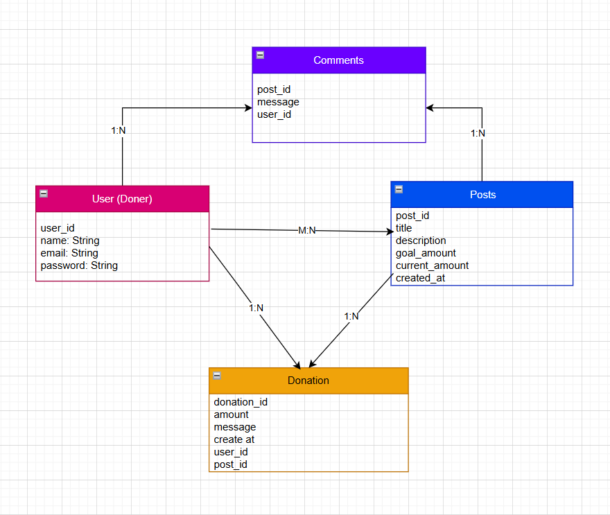
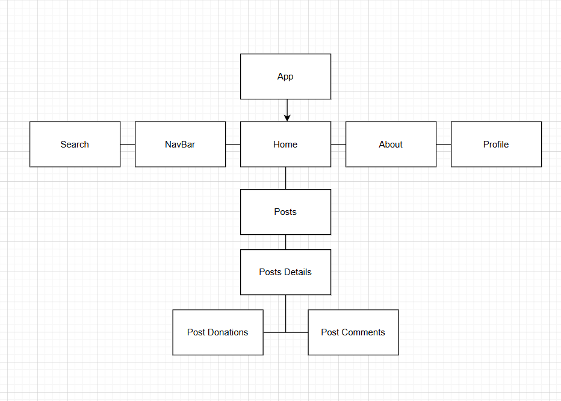
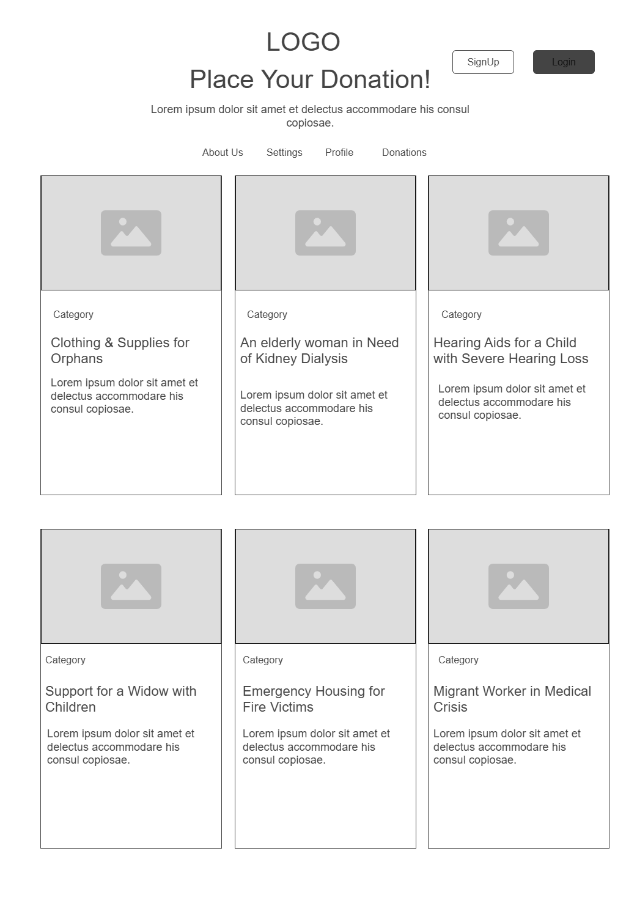
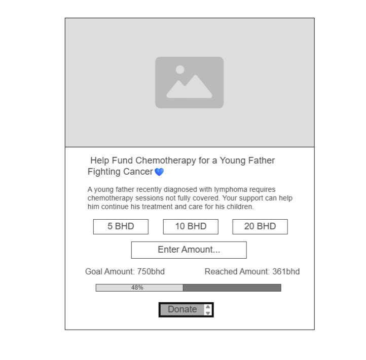

#              **AJR💸** - Fundraising Platform

## Date: 14/08/2025
###    BY: [Malak Jasim](https://github.com/Malak1805) | [LinkedIn](https://www.linkedin.com/in/malak-jasim-b518a1295/)

## 🔗 [Deployed Link](https://ajr.surge.sh/)

is a fundraising platform built using the MERN stack to support low-income individuals and those struggling financially. It provides a secure and easy to use environment where users can create fundraising posts, donate to campaigns posts, leave supportive comments, and manage their personal profiles.The goal of AJR is to connect donors and recipients, making the fundraising process transparent and accessible.

## 🚀 **Features**

- User Authentication: Secure registration and login system.

- Fundraising Posts: Users can create and manage donation posts with detailed goals and descriptions.

- Donations: Donate to various posts and track contribution progress.

- Support Comments: Leave encouraging comments on posts.

- User Profiles: Each user has a Profile Page

- Responsive UI: Optimized for desktop and mobile devices.

- RESTful API: Handles communication between frontend and backend.

- Testing & Validation: APIs tested with Postman.

## 🛠️ **Technologies Used**
### - Frontend

- React.js – Component-based frontend framework

- HTML & CSS – Structure and styling

- JavaScript 

### - Backend

- Node.js 

- Express.js 

- MongoDB database for storing users, posts, donations, and comments

- Postman – API testing and debugging

## **ERD & Diagrams**

## **🎨WireFrames**

## 💡**Future Enhancements**
- Online payment gateway integration (e.g., Stripe, PayPal).

- Admin dashboard for monitoring fundraising posts.

- Email and SMS notifications.

- Multi-language support.

## **Credits**
[W3schools](https://www.w3schools.com/) | [Geeksforgeeks](https://www.w3schools.com/) | [Github](https://github.com/Vivek-Kamboj/Crowd_funding)